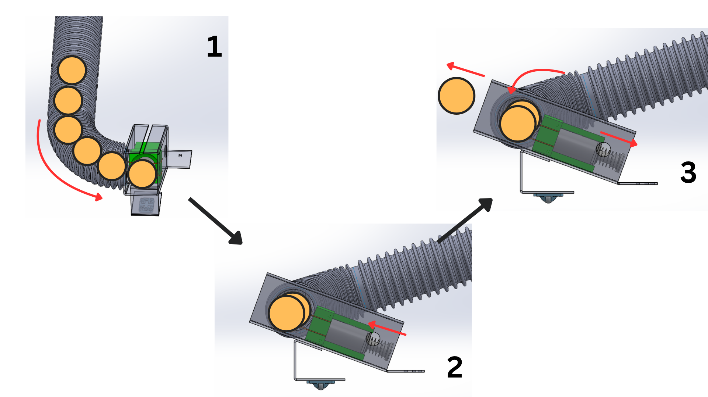
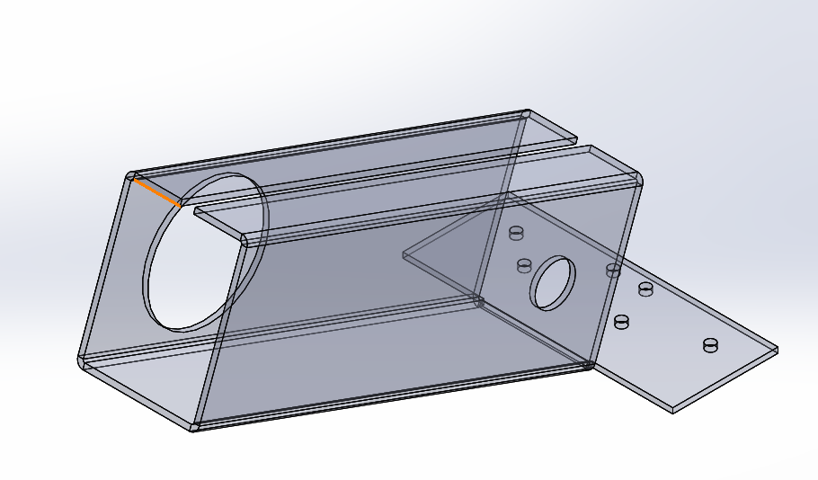
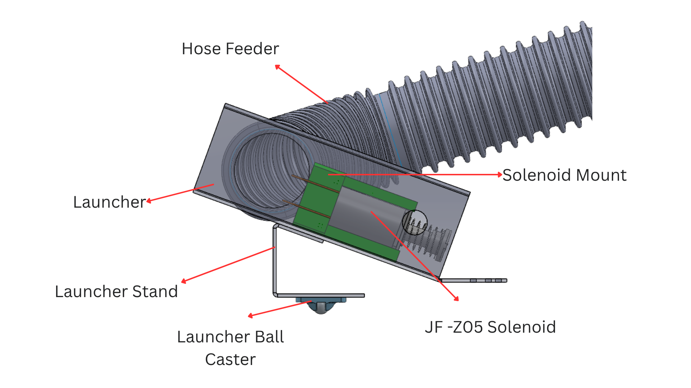
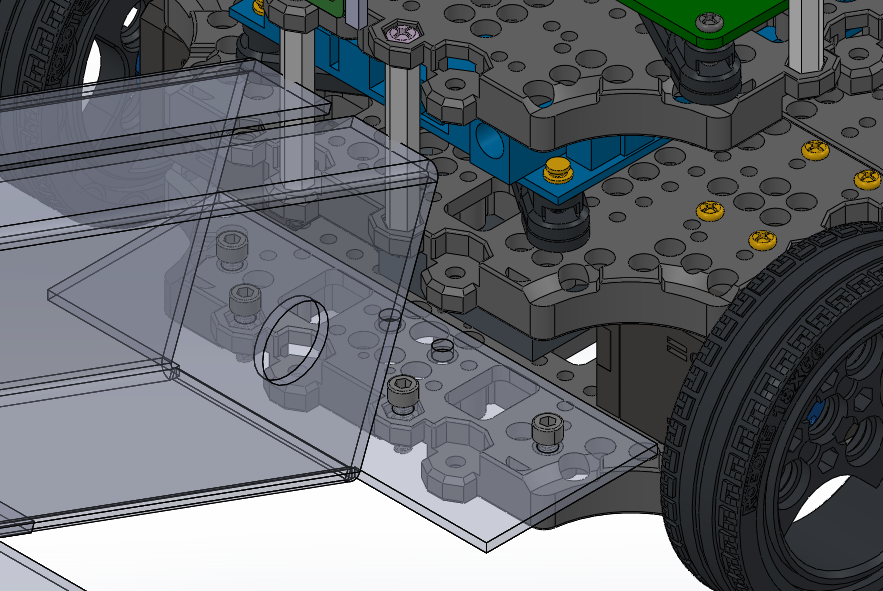

# TurtleBot Mechanical Documentation 
---
This document provides detailed instructions for printing, assembling, and integrating the launcher onto your TurtleBot.

---
## Components
---
### TurtleBot3 Subcomponents
- LiDAR
- RaspberryPi
- OpenCR 1.0
- 2x Dynamixel motors
- LiPo Battery
- USB2LDS

### Bill of Materials
- JF-Z05 Solenoid
- 400 Tie-Point Solderless Breadboard
- Zip ties
- Drain Hose (Inner Diameter: 45mm)
- Ball Caster
- Acrylic Sheet (400mm x 600mm x 2mm)
- Nylon Hex Spacers
- Moldable Metal Wires
- DC-168 Battery

### Printed Parts
- Solenoid Holder: Holds solenoid in place 
- RPi Camera Holder

### Laser Cut Parts (Acrylic)
- Launcher
- Launcher Stand

### Hardware
- Zip ties
- Drain Hose (Inner Diameter: 45mm)
- Ball Caster
- Hot Glue or any adhevsive
---
## Launching Mechanism

1. Ping Pong balls line up along the hose and the first ball is loaded into the launcher (First ball is aligned with center of solenoid)
2. Solenoid is actuated and plunger hits the ball at the end of its stroke length
3. Ball is accelerated flies out of launcher into receptacle. Plunger is retracted and next ball falls into place priming for the next shot
---
## Assembly Instructions
---
### Step 1: Launcher Assembly 

  1.  Using an acrylic bender, bend along the 4 construction lines (perpendicular to the longest axis) shown in the image above at 90 degrees
  2.  Bend the acrylic along notch (40mm from bottom) at 25 degrees
  3.  Glue ball caster to bottom of launcher stand
  4.  Glue launcher stand along barrel of launcher until desired height
  5.  Glue Solenoid and Solenoid Holder in barrel

You may follow the images above as reference

### Step 2: Installing Launcher

  1. Bolt launcher onto the 1st Waffle plate using M3 Hex Allan Screws and Nuts on the mounting points shown above
  2. Cut a slit on hose and fit it into 45mm hole on launcher
  3. Wrap hose around bot and secure hose using zip ties on highest waffle plate

---

## Mechanical and Assembly Recommendations
---
* Ensure that solenoid is aligned properly before securing it with adhesive
* Ensure that there is 7-10mm gap between the ball and launcher before each shot. This allows the plunger to accelerate substantially before hitting the ball. Use moldable wires
* Test the launching mechanism a few times to find desired ball & solenoid position 
---
## Design Reasoning 
---
### General:
* Used acrylic as it was the cheapest resource availble to our team allowing us to iterate through multiple designs. We wanted to stay away from 3D printing as much as possible to ensure we were under the budget of $80
* Only used a solenoid as it would be a simple launching mechanism for integration and allow for balls to be launched individually which was critical for Station A requirements

### Launcher: 
* Barrel dimensions were designed to only be able to fit one ping pong ball at a time (40mm diameter). This allows us to control the number of balls we fire at a time and the speed at which they are fired at
* Barrel angle (25 degrees) was determined through iteration and testing
* Addition of launcher stand with ball caster is to provide additional stability due to heavy weight of solenoid and its elevated position

### Storage & Feeding
* Buying a drain hose off the shelf made sure that we did not have to use 3D prints as storage options
* Since launcher could only fit one ball at a time, gravity feed system would suffice without the need for servos or actuators to hold balls in place
---
## Things to Consider
---
* Design is simple but also incurs greater reliability risk as ball trajectory depends heavily on ball position which is inconsistent and hard to replicate consistently
* Robot overall size is relatively large for maze which is bad for tight corners. Need to find ways to shorten launcher and feeding mechanism (hose)
* High energy requirements of solenoid dictated the need for a secondary power source and hence packaging might be an issue 
