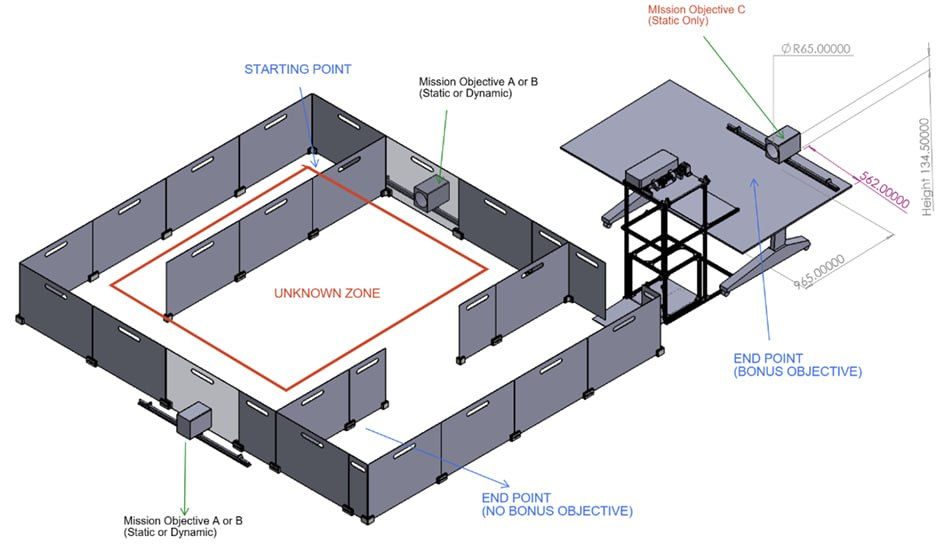
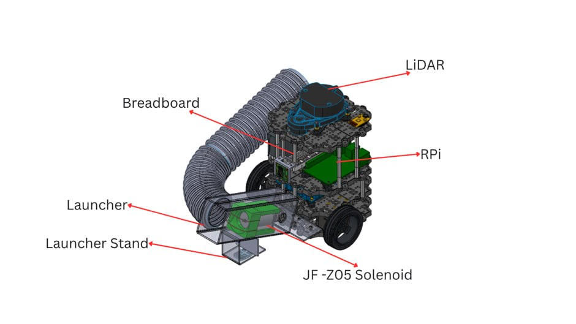
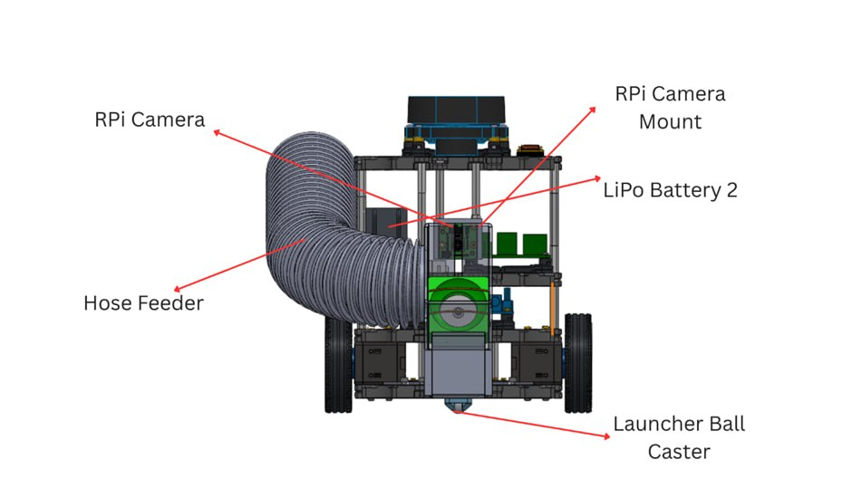
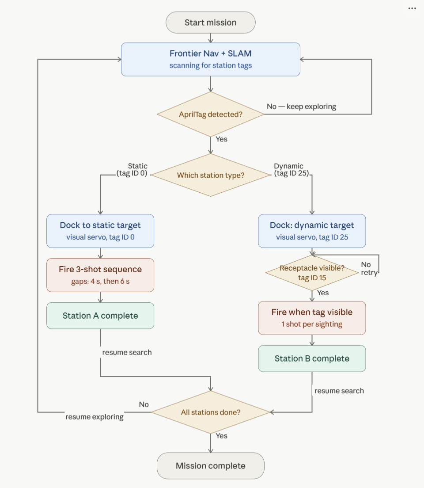

# Mission Overview & Objectives
### CDE2310 — Fundamentals of Systems Design | AY 2025–26 | Group 12

---

## Mission Overview

Our objective was to modify a **TurtleBot3** platform to perform a series of delivery tasks while autonomously navigating a maze — simulating logistical needs in a warehouse environment.

The TurtleBot system was fitted with an AMR workflow and made capable of **carrying and depositing ping-pong balls** into static and moving receptacles found around the maze. A bonus objective involved using an API call to summon a lift and perform a final delivery sequence at an elevated station.

**Key Constraints:**
- Must use an **RPi Camera** for landmark detection (AprilTag / ArUco markers at targets)
- Must operate **without line-following** techniques to solve the maze

---

## Problem Definition



From the starting point, the TurtleBot navigates through an unknown zone, mapping its way through walls and obstacles while detecting landmarks to execute deliveries:

| Station | Description |
|---------|-------------|
| **Station A** *(Fixed)* | Navigate to a fixed station identifiable by pre-deployed markers, dock and align, then fire **3 ping-pong balls** into a biscuit tin following a fixed timing pattern |
| **Station B** *(Dynamic)* | Detect a tin moving horizontally on a track via camera, dock appropriately, and deposit another batch of **3 balls** — timed to the receptacle's motion |
| **Station C** *(Bonus)* | Navigate to the lift lobby, summon the lift via API call, and deliver **3 more balls** into a static receptacle on the upper floor |

---

## System Requirements Analysis

### Project Deliverables

| Mission Requirement | Project Deliverable |
|---|---|
| Traverse Map Autonomously | The robot builds a map of the maze as it explores the environment |
| Navigate Maze Autonomously | The robot detects and works around obstacles during movement |
| Detect Landmarks | The robot recognises and reads fiducial markers at designated locations |
| Station A | Locate via fixed marker, align for docking, release 3 balls on a timed sequence |
| Station B | Determine movement pattern of station and time ball release accurately |

### Functional Requirements

| Mission Requirement | Functional Requirement |
|---|---|
| Traverse Map Autonomously | The robot shall apply **SLAM** to build and maintain a map in real time |
| Navigate Maze Autonomously | The robot shall use the generated map for path planning and obstacle reaction |
| Detect Landmarks | The robot shall use the **RPi Camera V2 (8MP)** to read markers at each mission location |
| Station A | Combine marker detection with SLAM localisation to align and dispense per the delay pattern, with all balls remaining in the receptacle |
| Station B | Track the oscillating receptacle's marker to predict its position |

### Non-Functional Requirements

| Category | Requirement |
|---|---|
| **Performance** | Complete all required tasks (maze mapping + deliveries to A & B) within **25 minutes**, including setup and cleanup |
| **Reliability** | Perform consistently regardless of maze layout changes, without contacting walls or obstacles |
| **Usability** | Any operator unfamiliar with the system shall be able to use it efficiently |
| **Accuracy** | Position precisely enough at each station to guarantee payload delivery and reliable marker detection |
| **Maintainability** | Major system components shall be accessible for inspection or replacement |
| **Efficiency** | Power consumption shall keep the robot operational throughout the full mission without recharging |

### Constraints

| Category | Constraint |
|---|---|
| **Power** | All tasks must fit within the TurtleBot3 Burger's available battery charge and voltage range |
| **Sensors** | All additional sensors must work within ROS2. No cameras beyond the issued RPi Camera V2 8MP are permitted |
| **Processing** | Algorithm design must account for the Raspberry Pi's constrained CPU and memory |
| **Environment** | Variations in room lighting may affect marker detection accuracy |
| **Cost** | Component choices must fit within the project budget |
| **Markers** | Maximum of **6 markers** permitted; must be placed and removed within 25 minutes without damage |
| **Navigation** | The robot must navigate autonomously — line-following and human-guided mapping are **not permitted** |

---

## System Overview

### Physical Design

Our primary mechanical modification is a **launcher system powered by a 45N solenoid**. Once the RPi Camera (mounted on the robot) detects a mission objective, the docking sequence is initiated. The solenoid briefly activates to strike a ball into the tin, while the hose feeder deposits the next ball via gravity for the subsequent launch.





### Algorithm

The diagram below shows the high-level logic flow of the mission system — from frontier exploration through AprilTag-based station detection, visual-servo docking, and ball launching, to mission completion.



**Key logic highlights:**

- The robot runs **Frontier Nav + SLAM** continuously, scanning for station AprilTags.
- On detecting a tag, it classifies the station type (static tag ID 0, or dynamic tag ID 25) and initiates the appropriate docking and firing sequence.
- **Station A (static):** docks via visual servoing on tag ID 0, then fires a 3-shot sequence with fixed inter-shot gaps (4 s, then 6 s).
- **Station B (dynamic):** docks on tag ID 25, then polls for the receptacle tag (ID 15) and fires one ball each time the tag is visible, repeating until 3 balls are deposited.
- After each station is complete, the robot **resumes frontier exploration** and ignores the completed station's tag, searching for any remaining stations.
- Once **all stations are done**, the mission ends.

### Specifications

| Parameter | Value |
|---|---|
| **Model** | TurtleBot3 Burger |
| **Weight** | 1.68 kg |
| **Dimensions** | 290 × 175 × 195 mm |
| **Centre of Gravity** | X: –9.996, Y: 41.440, Z: 65.226 mm |
| **Battery** | Lithium Polymer (LiPo), 11.1 V, 1800 mAh (19.98 Wh) |
| **Purpose** | Autonomous mobile robot for warehouse material handling — navigates structured environments and deposits payloads into static and dynamic target zones |

---

## Repository Structure

This repository uses two primary branches:

| Branch | Purpose |
|---|---|
| `main` | Stable, consolidated codebase — project README and final deliverables live here |
| `integration` | Active development branch — all subsystem work is merged here before a final PR into `main` |

```
Group_12_CDE2310_AY2025-26/
├── assets/                          # Images and diagrams referenced in the README
│   ├── algorithm_flowchart.png
│   ├── arena_layout.png
│   ├── robot_front.png
│   └── robot_isometric.png
├── Budget/                          # Project budget documentation
│   └── budget.md
├── Electrical/                      # Electrical schematics, circuitry, and documentation
│   ├── testing_code/
│   ├── Electrical diagram and Electronics system architecture.pdf
│   ├── Electrical_documentation.md
│   └── Power_calculations_document.pdf
├── Mechanical/                      # Mechanical design files and CAD
│   ├── CAD Files/
│   ├── Mech_Docs/images/
│   ├── Center of Gravity.xlsx
│   └── Turtlebot_mechanical_documentation.md
├── Media/                           # Photos and video links
│   ├── Turtlebot_Pictures/
│   └── Video_link.md
├── Reflections/                     # Team reflections and lessons learned
│   ├── Elec_reflection.md
│   ├── Mech_reflection.md
│   └── Software_reflection.md
├── remote_pc_codebase/              # Code running on the laptop/PC (navigation, mission coordinator)
│   ├── Code Explanations/           # Developer Guide and Software Design documentation
│   ├── flow_chart_diagrams/         # Flowchart PNGs for all navigation and mission logic
│   ├── archive/                     # Archived / legacy navigation files
│   ├── mission_coordinator_final.py
│   ├── nav_final.py
│   ├── nav2_params_frontier.yaml
│   ├── package.xml
│   ├── setup.py
│   └── users.txt
├── rpi_codebase/                    # Code deployed on the Raspberry Pi (AprilTag detection, docking, launcher)
│   ├── Code Explanations/           # RPi node documentation
│   ├── Flowcharts/                  # Flowchart PNGs for RPi node logic
│   ├── archive_apriltag_code/       # Archived AprilTag detection iterations
│   ├── archive_docking_code/        # Archived dock controller iterations
│   ├── archive_launcher_code/       # Archived launcher controller iterations
│   ├── apriltag_detector_final.py
│   ├── dock_controller_final.py
│   ├── launcher_controller_final.py
│   ├── package.xml
│   └── setup.py
├── archive/                         # Top-level archived / legacy files
├── .gitattributes
├── .gitignore
└── README.md
```

---

---

## Subsystem Navigation

| Subsystem | Description | Link |
|-----------|-------------|------|
| Remote PC Codebase | Navigation node, mission coordinator, Nav2 config | [remote\_pc\_codebase/](https://github.com/Sid504-dot/Group_12_CDE2310_AY2025-26/tree/main/remote_pc_codebase) |
| RPi Codebase | AprilTag detector, dock controller, launcher controller | [rpi\_codebase/](https://github.com/Sid504-dot/Group_12_CDE2310_AY2025-26/tree/main/rpi_codebase) |
| Electrical | Schematics, power calculations, electrical documentation | [Electrical/](https://github.com/Sid504-dot/Group_12_CDE2310_AY2025-26/tree/main/Electrical) |
| Mechanical | CAD files, mechanical documentation, centre of gravity | [Mechanical/](https://github.com/Sid504-dot/Group_12_CDE2310_AY2025-26/tree/main/Mechanical) |
| Media | Robot photos and video links | [Media/](https://github.com/Sid504-dot/Group_12_CDE2310_AY2025-26/tree/main/Media) |
| Budget | Project budget breakdown | [Budget/](https://github.com/Sid504-dot/Group_12_CDE2310_AY2025-26/tree/main/Budget) |
| Reflections | Electrical, mechanical and software reflections | [Reflections/](https://github.com/Sid504-dot/Group_12_CDE2310_AY2025-26/tree/main/Reflections) |

---

## Team

**Group 12 — CDE2310 AY2025–26**

> Forked from [NickInSynchronicity/r2auto_nav_CDE2310](https://github.com/NickInSynchronicity/r2auto_nav_CDE2310)
