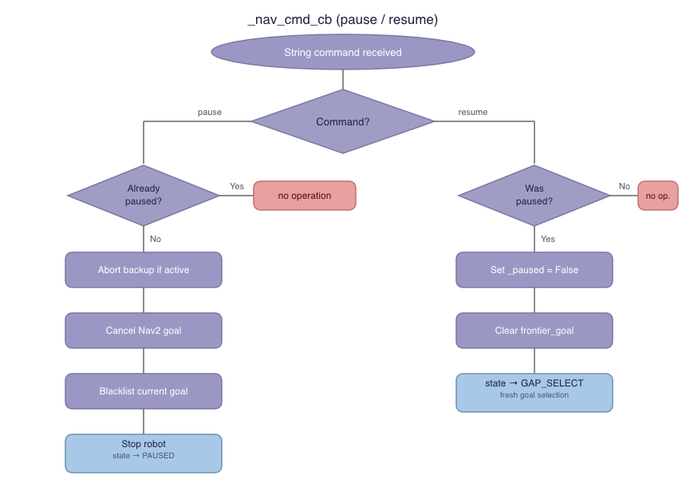
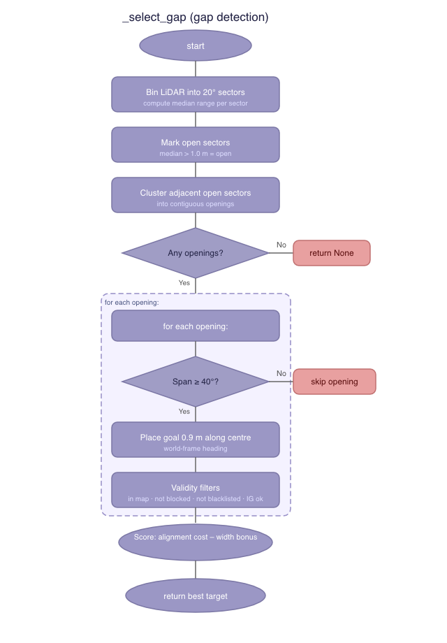
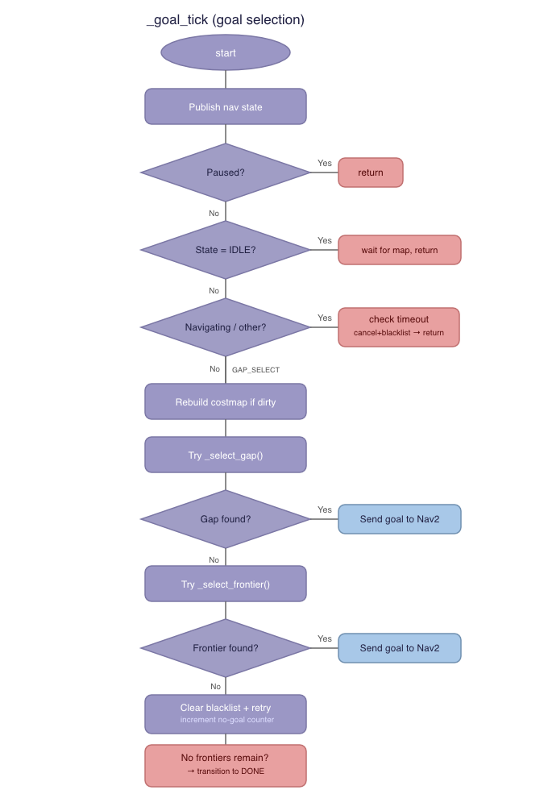
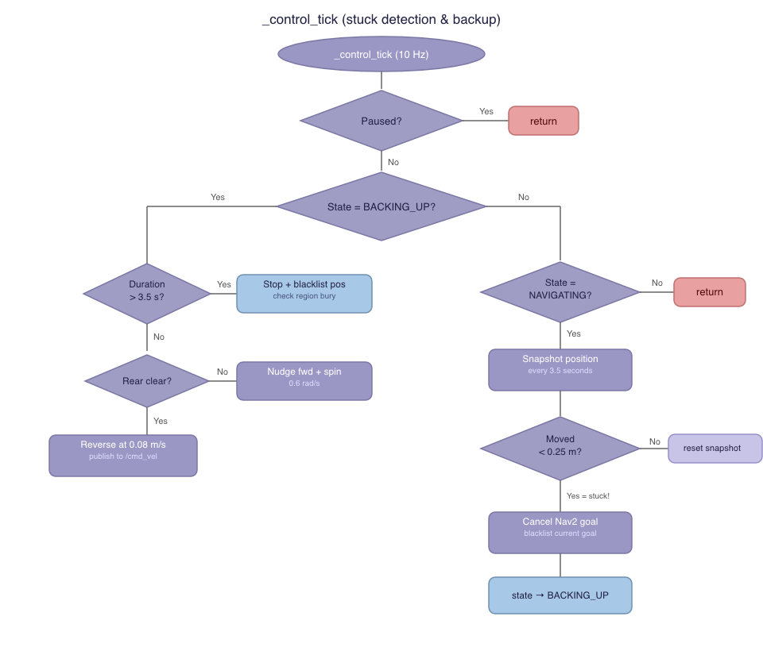
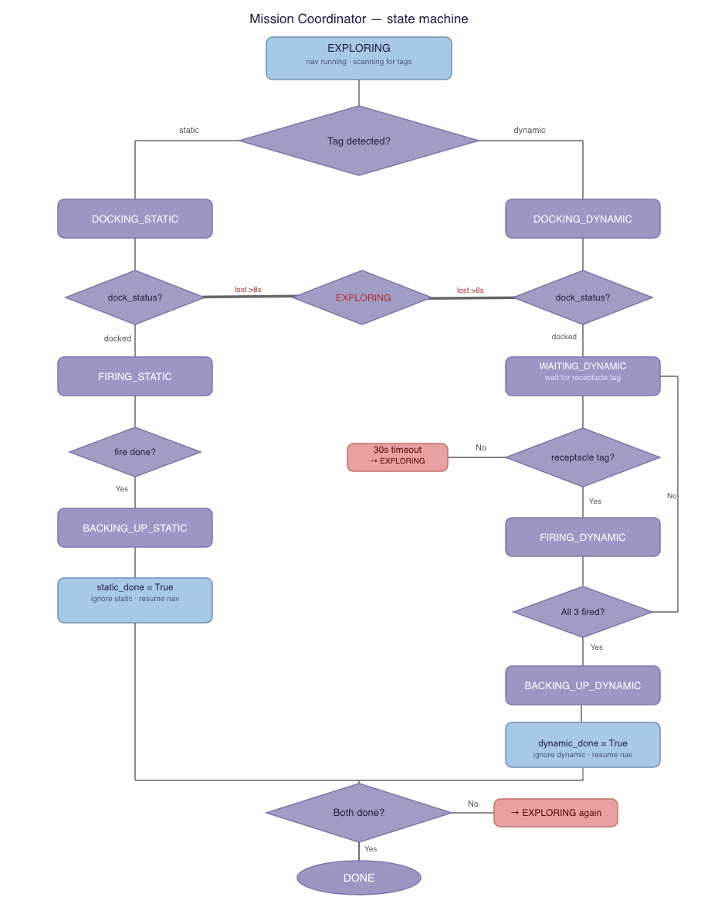
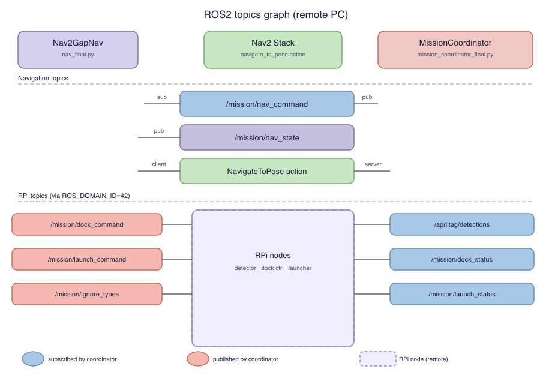

# Developer Guide for Turtlebot's Navigation and Mission Coordinator (FSM)

This document describes the high-level design of the navigation and mission control constructs for the Turtlebot ICBM. The system runs across two platforms: the remote PC (laptop) handles navigation and mission coordination, while the Raspberry Pi handles AprilTag detection, dock control, and launcher control. This guide covers the remote PC codebase only.

## Laptop Terminals

**Terminal 1 — SLAM**
```bash
export TURTLEBOT3_MODEL=burger && export ROS_DOMAIN_ID=42
ros2 launch turtlebot3_cartographer cartographer.launch.py
```

**Terminal 2 — Nav2**
```bash
export ROS_DOMAIN_ID=42
ros2 launch nav2_bringup navigation_launch.py \
  params_file:=$HOME/colcon_ws/src/auto_nav/config/nav2_params_frontier.yaml \
  use_sim_time:=false
```

**Terminal 3 — Navigation**
```bash
export ROS_DOMAIN_ID=42 && source ~/colcon_ws/install/setup.bash
ros2 run auto_nav nav_final
```

**Terminal 4 — Mission Coordinator**
```bash
export ROS_DOMAIN_ID=42 && source ~/colcon_ws/install/setup.bash
ros2 run auto_nav mission_coordinator_final
```

**Terminal 5 — Monitor**
```bash
export ROS_DOMAIN_ID=42
ros2 topic echo /mission/state
```

---

## Nav2GapNav Node

**API:** `nav_final.py`

The main navigation control node for the Turtlebot ICBM. It performs autonomous frontier exploration using a gap-first strategy: LiDAR openings are prioritised over map-based frontiers. All path execution is delegated to Nav2 (SmacPlanner2D + MPPIController).

> For algorithm rationale, design decisions, Nav2 configuration, and tuning guidance on when and why to change these values, see [Software_design.md](Software_design.md).

### Tunable parameters

- `FRONTIER_HZ` : The frequency (Hz) of the goal selection timer. Default: 2.0.
- `CONTROL_HZ` : The frequency (Hz) of the stuck detection and backup timer. Default: 10.0.
- `OPEN_THRESH_M` : The minimum median range (metres) for a LiDAR sector to be considered open. Default: 1.00.
- `SECTOR_DEG` : The angular bin width (degrees) for LiDAR sector binning. Default: 20.
- `MIN_OPEN_DEG` : The minimum angular span (degrees) an opening must have to be considered usable. Default: 40.
- `OPEN_GOAL_D` : The distance (metres) along the opening centre direction at which the goal is placed. Default: 0.90.
- `GAP_MIN_D` : The minimum distance (metres) between the robot and a gap goal. Goals closer than this are discarded. Default: 0.30.
- `W_OPEN_ALIGN` : Scoring weight that penalises openings requiring more turning. Default: 2.0.
- `W_OPEN_WIDTH` : Scoring weight that rewards wider openings. Default: 0.4.
- `BIN_CELLS` : The number of map cells per spatial bin for frontier clustering. Default: 10.
- `BIN_MIN` : The minimum number of frontier cells in a bin for it to be considered. Default: 2.
- `W_SIZE` : Frontier scoring weight for cluster size. Default: 0.3.
- `W_INFO` : Frontier scoring weight for information gain. Default: 1.8.
- `W_HEADING` : Frontier scoring weight for heading alignment. Default: 1.5.
- `FRONTIER_MIN_D` : The minimum distance (metres) to a frontier goal. Default: 0.25.
- `LIDAR_RANGE_M` : The maximum effective LiDAR range (metres) used for info gain calculations. Default: 3.5.
- `OCC_THRESH` : The occupancy grid value at or above which a cell is considered occupied. Default: 60.
- `MAP_OCC_THRESH` : The threshold for the internal costmap's occupied classification. Default: 60.
- `INFLATION_R` : The inflation radius (metres) applied to obstacles in the internal costmap. Default: 0.15.
- `IG_RATIO_MIN` : The minimum information gain ratio for a goal to be viable. Default: 0.05.
- `BLACKLIST_R` : The radius (metres) around a blacklisted goal. New goals within this radius are rejected. Default: 0.80.
- `STUCK_BL_R` : The radius (metres) for stuck-blacklist proximity checks. Default: 1.00.
- `REGION_BL_R` : The radius (metres) defining a "region" for repeated stuck detection. Default: 1.0.
- `REGION_STUCK_THRESH` : The number of stuck events in a region before it is buried (made permanently inaccessible). Default: 3.
- `MAX_BLACKLIST` : The maximum number of entries in the normal blacklist before oldest entries are pruned. Default: 60.
- `FRONTIER_TO` : The timeout (seconds) before a Nav2 goal is cancelled and blacklisted. Default: 45.0.
- `NO_FRONTIER_RETRIES` : The number of consecutive no-goal cycles before checking whether exploration is complete. Default: 3.
- `STUCK_DIST` : The Turtlebot ICBM must move at least this distance (metres) within `STUCK_TIME` seconds, otherwise it is declared stuck. Default: 0.25.
- `STUCK_TIME` : The time window (seconds) for stuck detection snapshots. Default: 3.5.
- `BACKUP_SPEED` : The linear velocity (m/s) when reversing during backup. Default: 0.08.
- `BACKUP_DURATION` : The duration (seconds) of the backup manoeuvre. Default: 3.5.
- `BACKUP_REAR_CLEAR` : The minimum rear clearance (metres) required to allow reversing. If the rear is closer than this, the robot nudges forward and spins instead. Default: 0.28.

### Attributes

- `tf_buffer` , `tf_listener` : Used to determine the coordinates of the Turtlebot3 ICBM with respect to the `map` frame.
- `map_raw` : The raw occupancy grid data from the `/map` topic, stored as a numpy array of shape (height, width).
- `map_w` , `map_h` : The width and height of the occupancy grid in cells.
- `map_res` : The resolution of the occupancy grid (metres per cell).
- `map_ox` , `map_oy` : The origin coordinates of the occupancy grid in the world frame.
- `blocked_grid` : An inflated binary grid where True indicates an occupied or inflation-padded cell.
- `have_map` : Whether at least one `/map` message has been received.
- `map_dirty` : Whether the internal costmap needs rebuilding after a new `/map` message.
- `scan_ranges` : A numpy array of LiDAR range values from the `/scan` topic. Out-of-range values are replaced with NaN.
- `scan_angle_min` : The starting angle (radians) of the LiDAR scan.
- `scan_angle_inc` : The angular increment (radians) between consecutive LiDAR rays.
- `state` : The current state of the navigation node. One of: `IDLE`, `GAP_SELECT`, `NAVIGATING`, `BACKING_UP`, `PAUSED`, `DONE`.
- `frontier_goal` : The current goal coordinates (x, y) being navigated to, or None if no goal is active.
- `goal_start_t` : The timestamp when the current goal was sent to Nav2, used for timeout detection.
- `nav_handle` : The Nav2 action goal handle for the current navigation goal, or None.
- `blacklist` : A list of blacklisted goal coordinates with timestamps. Goals near these are rejected.
- `stuck_blacklist` : A separate blacklist for positions where the robot got stuck. Uses a larger rejection radius than the normal blacklist.
- `_no_goal_cnt` : A counter for consecutive goal selection cycles where no valid goal was found.
- `stuck_check_pos` : The position snapshot (x, y) used for stuck detection comparison.
- `stuck_check_t` : The timestamp of the last stuck detection position snapshot.
- `backup_start_t` : The timestamp when the backup manoeuvre started.
- `stuck_pos` : The position (x, y) where the robot was declared stuck, used for stuck-blacklisting after backup completes.
- `_paused` : Represents whether navigation is currently paused by the mission coordinator.
- `_cmd_pub` : A `Twist` publisher that controls movement of the Turtlebot ICBM via `/cmd_vel`. Only used during backup manoeuvres.
- `_state_pub` : A `String` publisher for `/mission/nav_state` that broadcasts the current navigation state.
- `nav_client` : An `ActionClient` for Nav2's `NavigateToPose` action, used to send goal poses to the Nav2 stack.

### Methods

**_map_cb:**

- Arguments:
    - `msg` : An OccupancyGrid message from the `/map` topic.
- Returns: None
- Effects: Stores the occupancy grid data as a numpy array and marks the internal costmap as dirty for rebuilding.

**_scan_cb:**

- Arguments:
    - `msg` : A LaserScan message from the `/scan` topic.
- Returns: None
- Effects: Stores the LiDAR range data as a numpy array. Values outside the sensor's valid range are replaced with NaN.

**_nav_cmd_cb:**

- Arguments:
    - `msg` : A String message containing either "pause" or "resume".
- Returns: None
- Effects: Pauses or resumes navigation. Pause is idempotent: it aborts any active backup, cancels any active Nav2 goal, blacklists the current goal, stops the robot, and sets the state to PAUSED. Resume is also idempotent: it clears the current goal and transitions to GAP_SELECT for fresh goal selection.



**_get_pose:**

- Arguments: None
- Returns: A tuple (x, y, yaw) of the Turtlebot3 ICBM's position and heading in the `map` frame, or None if the TF lookup fails. Tries `base_footprint` first, then `base_link`.

**_world_to_map:**

- Arguments:
    - `wx` , `wy` : World coordinates (metres) to convert.
- Returns: A tuple (mx, my) of map cell indices, or None if the coordinates are outside the map bounds.

**_map_to_world:**

- Arguments:
    - `mx` , `my` : Map cell indices to convert.
- Returns: A tuple (wx, wy) of world coordinates corresponding to the centre of the cell.

**_rebuild_costmap:**

- Arguments: None
- Returns: None
- Effects: Inflates all occupied cells in the map by `INFLATION_R` using a box kernel to create the `blocked_grid`. Clears the `map_dirty` flag.

**_grid_blocked:**

- Arguments:
    - `cell` : A tuple (mx, my) of map cell indices, or None.
- Returns: True if the cell is within the inflated costmap (occupied or inflation-padded), False otherwise. Returns False if cell is None or the grid has not been built.

**_arc_min:**

- Arguments:
    - `center_deg` : The centre angle of the arc in degrees (0 = front, 180 = rear).
    - `half_deg` : The half-width of the arc in degrees.
- Returns: The minimum valid LiDAR range within the specified arc, or infinity if no valid readings exist in the arc.

**_calc_info_gain:**

- Arguments:
    - `cx` , `cy` : Map cell indices of the position to evaluate.
- Returns: The number of unknown cells (value == -1) within a square region of side length `2 * LIDAR_RANGE_M / map_res` centred on the given position.

**_ig_ratio:**

- Arguments:
    - `cx` , `cy` : Map cell indices of the position to evaluate.
- Returns: The ratio of unknown cells to the maximum possible area (a circle of radius `LIDAR_RANGE_M`). Used to filter out goals near fully-explored areas.

**_select_gap:**

- Arguments:
    - `rx` , `ry` , `yaw` : The robot's current position (metres) and heading (radians) in the map frame.
- Returns: A tuple (gx, gy) of the best gap goal coordinates, or None if no valid gap exists.
- Effects: Bins LiDAR rays into 20° sectors, takes the median range per sector, marks sectors with median > 1.0 m as open, clusters adjacent open sectors into contiguous openings, discards openings narrower than 40°, places a goal 0.9 m along the opening's centre direction, then validates and scores all candidates.



**_select_frontier:**

- Arguments:
    - `rx` , `ry` , `yaw` : The robot's current position (metres) and heading (radians) in the map frame.
- Returns: A tuple (gx, gy) of the best frontier goal coordinates, or None if no valid frontier exists.
- Effects: Finds all free cells adjacent to at least one unknown cell. Bins these frontier cells spatially into clusters. For each cluster, selects the cell closest to the centroid as the candidate goal. Filters by distance, blacklist proximity, costmap clearance, info gain ratio, and regional stuck history. Scores candidates by travel efficiency adjusted for heading alignment and cluster size.

**_goal_tick:**

- Arguments: None
- Returns: None
- Effects: The main goal selection loop running at `FRONTIER_HZ`. Publishes the current navigation state. In the `GAP_SELECT` state: rebuilds the costmap if dirty, tries `_select_gap()` first, falls back to `_select_frontier()` if no gap is found. If both fail, clears the normal blacklist and retries. After `NO_FRONTIER_RETRIES` consecutive failures, checks if any frontier cells remain in the map — if none, transitions to DONE. If the state is `NAVIGATING`, checks for goal timeout.



**_send_nav2_goal:**

- Arguments:
    - `gx` , `gy` : The goal coordinates (metres) in the map frame.
    - `rx` , `ry` : The robot's current position (metres), used to compute the goal heading.
- Returns: None
- Effects: Constructs a PoseStamped goal with orientation facing from (rx, ry) toward (gx, gy) and sends it to Nav2 via the NavigateToPose action.

**_on_nav_response:**

- Arguments:
    - `future` : The action response future from Nav2.
- Returns: None
- Effects: Handles Nav2's acceptance or rejection of the goal. If rejected, the goal is blacklisted and state returns to GAP_SELECT (unless paused).

**_on_nav_result:**

- Arguments:
    - `future` : The action result future from Nav2.
- Returns: None
- Effects: Handles Nav2 goal completion. Both success and failure cause the goal to be blacklisted (so the robot moves on to new areas). Transitions to GAP_SELECT unless paused.

**_cancel_nav2_goal:**

- Arguments: None
- Returns: None
- Effects: Cancels the active Nav2 goal if one exists and clears the nav_handle.

**_control_tick:**

- Arguments: None
- Returns: None
- Effects: The stuck detection and backup control loop running at `CONTROL_HZ`. When the state is `NAVIGATING`, it takes periodic position snapshots. If the robot has moved less than `STUCK_DIST` in `STUCK_TIME` seconds, it declares the robot stuck, cancels the Nav2 goal, blacklists the goal, and transitions to `BACKING_UP`. When the state is `BACKING_UP`, it checks rear clearance and either reverses at `BACKUP_SPEED` or nudges forward with a spin if the rear is blocked. After backup completes, the stuck position is added to the stuck-blacklist. If the same region has triggered stuck detection `REGION_STUCK_THRESH` times, the region is buried by adding multiple blacklist entries.



**_stop:**

- Arguments: None
- Returns: None
- Effects: Publishes a zero-velocity `Twist` message to `/cmd_vel`, stopping the Turtlebot ICBM.

**_blacklist_goal:**

- Arguments: None
- Returns: None
- Effects: Adds the current `frontier_goal` coordinates and a timestamp to the blacklist. Prunes the blacklist to the most recent `MAX_BLACKLIST` entries. Clears `frontier_goal` and `goal_start_t`.

---

## MissionCoordinator Node

**API:** `mission_coordinator_final.py`

The mission orchestration node that coordinates exploration, docking, firing, and backing up for both static and dynamic targets. It communicates with the navigation node via pause/resume commands and with RPi-side nodes (AprilTag detector, dock controller, launcher controller) via JSON-over-String topics.

> For FSM design rationale, state-by-state walk-throughs, and tuning guidance, see [Software_design.md](Software_design.md).

### Tunable parameters

- `COORDINATOR_HZ` : The tick frequency (Hz) of the mission coordinator main loop. Default: 20.
- `DETECTION_RANGE_M` : The maximum range (metres) at which a detected AprilTag is considered actionable. Tags farther than this are ignored. Default: 1.5.
- `DYNAMIC_BALL_COUNT` : The number of balls to fire at the dynamic target. Default: 3.
- `DOCK_LOST_DEBOUNCE_S` : The duration (seconds) the dock status must remain 'lost' before the coordinator aborts the docking attempt. Default: 8.0.
- `WAITING_DYNAMIC_TIMEOUT_S` : The maximum wait time (seconds) for the receptacle tag to appear after docking to the dynamic target. Default: 30.0.
- `DOCK_TIMEOUT_S` : The maximum duration (seconds) for the entire dock+fire cycle before aborting. Default: 45.0.
- `TAG_STALE_S` : The maximum age (seconds) of an AprilTag detection before it is considered stale and ignored. Default: 1.0.
- `TEST_MODE` : When True, enables re-triggering of the static target after a cooldown period instead of marking it as permanently done. Default: False.
- `STATIC_COOLDOWN_S` : The cooldown period (seconds) in TEST_MODE before the static target can be re-detected. Default: 10.0.

### Attributes

- `state` : The current mission state. One of: `EXPLORING`, `DOCKING_STATIC`, `FIRING_STATIC`, `BACKING_UP_STATIC`, `COOLDOWN`, `DOCKING_DYNAMIC`, `WAITING_DYNAMIC`, `FIRING_DYNAMIC`, `BACKING_UP_DYNAMIC`, `DONE`.
- `static_done` : Represents whether the static target sequence (dock, fire, backup) has been completed.
- `dynamic_done` : Represents whether the dynamic target sequence has been completed.
- `dock_status` : The latest status string from the dock controller. Possible values: 'idle', 'docked', 'lost', 'backup_done'.
- `launch_status` : The latest status string from the launcher controller. Possible values include: 'static_done', 'dynamic_fired_1', 'dynamic_done'.
- `dynamic_balls_fired` : A counter tracking how many balls have been fired at the dynamic target in the current sequence.
- `latest_tags` : A list of currently detected AprilTag dictionaries from the detector node. Each entry has keys: 'id', 'type', 'dist'.
- `last_det_time` : The timestamp of the most recent tag detection message, used for stale detection.
- `_dock_sent` : Whether the dock command has been sent in the current docking state. Reset on each state entry.
- `_fire_sent` : Whether the fire command has been sent in the current firing state.
- `_cooldown_t` : The timestamp when cooldown started (TEST_MODE only).
- `_dock_lost_since` : The timestamp when the dock status first became 'lost', or None if the status is not 'lost'. Used for debouncing.
- `_backup_done_latch` : A latch flag that is set to True when 'backup_done' is received from the dock controller.
- `_waiting_dynamic_start_t` : The timestamp when the `WAITING_DYNAMIC` state was entered, used for timeout.
- `_dock_start_t` : The timestamp when docking began, used for the overall dock timeout check.
- `_nav_settle_until` : A timestamp until which the coordinator waits (0.5 seconds) for navigation to settle before sending the dock command.
- `nav_cmd_pub` : A `String` publisher for `/mission/nav_command`. Sends 'pause' or 'resume' to the navigation node.
- `dock_cmd_pub` : A `String` publisher for `/mission/dock_command`. Sends 'dock_static', 'dock_dynamic', 'backup', or 'cancel' to the dock controller on the RPi.
- `launch_cmd_pub` : A `String` publisher for `/mission/launch_command`. Sends 'fire_static' or 'fire_one' to the launcher controller on the RPi.
- `ignore_pub` : A `String` publisher for `/mission/ignore_types`. Sends comma-separated tag type names to tell the AprilTag detector which types to ignore.
- `state_pub` : A `String` publisher for `/mission/state`. Broadcasts the current mission state at every tick.

### Methods

**_det_cb:**

- Arguments:
    - `msg` : A String message containing JSON with a 'tags' list.
- Returns: None
- Effects: Parses the JSON, stores the list of detected tags in `latest_tags`, and records the detection timestamp.

**_dock_status_cb:**

- Arguments:
    - `msg` : A String message from the dock controller.
- Returns: None
- Effects: Updates `dock_status`. If the status transitions to 'lost', records the timestamp in `_dock_lost_since` for debouncing. If the status is 'backup_done', sets the `_backup_done_latch` flag.

**_launch_status_cb:**

- Arguments:
    - `msg` : A String message from the launcher controller.
- Returns: None
- Effects: Updates `launch_status`.

**_pub:**

- Arguments:
    - `publisher` : The ROS2 publisher to use.
    - `text` : The string payload to publish.
- Returns: None
- Effects: Wraps the text in a String message and publishes it.

**_pause_nav:**

- Arguments: None
- Returns: None
- Effects: Sends 'pause' to the navigation node via `/mission/nav_command`.

**_resume_nav:**

- Arguments: None
- Returns: None
- Effects: Sends 'resume' to the navigation node via `/mission/nav_command`.

**_set_ignore:**

- Arguments:
    - `*types` : A variable number of tag type strings (e.g., 'static', 'dynamic_dock').
- Returns: None
- Effects: Publishes the comma-separated tag types to `/mission/ignore_types`, instructing the detector to stop reporting those types.

**_find_tag:**

- Arguments:
    - `tag_type` : The tag type string to search for (e.g., 'static', 'dynamic_dock', 'dynamic_receptacle').
- Returns: The closest in-range tag dictionary of the given type, or None if detections are stale (older than `TAG_STALE_S`) or no matching tag is within `DETECTION_RANGE_M`.

**_lost_too_long:**

- Arguments: None
- Returns: True if the dock status has been continuously 'lost' for longer than `DOCK_LOST_DEBOUNCE_S` seconds. False otherwise.

**_dock_timed_out:**

- Arguments: None
- Returns: True if the current dock+fire cycle has exceeded `DOCK_TIMEOUT_S` seconds since `_dock_start_t` was set. False otherwise.

**_abort_dock_retry:**

- Arguments:
    - `label` : A string label for logging (e.g., 'DOCKING_STATIC', 'FIRING_DYNAMIC').
- Returns: None
- Effects: Cancels the dock command, clears timeout and debounce state, resumes navigation, and returns to EXPLORING. The target is NOT marked as done, allowing the robot to retry on a future encounter.

**_start_docking:**

- Arguments:
    - `tag` : A tag dictionary with 'id', 'type', and 'dist' fields.
    - `target_state` : The state to transition to (e.g., `DOCKING_STATIC` or `DOCKING_DYNAMIC`).
- Returns: None
- Effects: Pauses navigation, sets a 0.5-second settle timer, resets the dock-sent flag, records the dock start timestamp, and transitions to the target docking state.

**_tick:**

- Arguments: None
- Returns: None
- Effects: The main 20 Hz state machine loop. Publishes the current mission state. Handles all state transitions:
    - **EXPLORING:** Checks for static tags (priority) then dynamic dock tags. If found, calls `_start_docking()`. If both `static_done` and `dynamic_done` are True, transitions to DONE.
    - **DOCKING_STATIC:** Waits for nav to settle, then sends 'dock_static'. If dock reports 'docked', transitions to FIRING_STATIC. If dock is lost beyond debounce, cancels and resumes nav. If dock timeout expires, aborts with retry.
    - **FIRING_STATIC:** Waits for 'static_done' from the launcher. If received, sends 'backup' and transitions to BACKING_UP_STATIC. If dock timeout expires, aborts with retry.
    - **BACKING_UP_STATIC:** Waits for 'backup_done' latch. Sets `static_done = True`, tells detector to ignore static tags, resumes nav, and returns to EXPLORING. In TEST_MODE, enters COOLDOWN instead.
    - **COOLDOWN (TEST_MODE only):** Waits for `STATIC_COOLDOWN_S` seconds, then resets and returns to EXPLORING for re-testing.
    - **DOCKING_DYNAMIC:** Same flow as DOCKING_STATIC but sends 'dock_dynamic'. On success, transitions to WAITING_DYNAMIC.
    - **WAITING_DYNAMIC:** Waits for the 'dynamic_receptacle' tag to appear. If detected, fires one ball and transitions to FIRING_DYNAMIC. If timeout expires, cancels and resumes nav.
    - **FIRING_DYNAMIC:** Waits for 'dynamic_fired' or 'dynamic_done' from the launcher. If `dynamic_balls_fired < DYNAMIC_BALL_COUNT`, returns to WAITING_DYNAMIC for the next ball. Otherwise, sends 'backup' and transitions to BACKING_UP_DYNAMIC.
    - **BACKING_UP_DYNAMIC:** Waits for 'backup_done' latch. Sets `dynamic_done = True`, tells detector to ignore dynamic tags, resumes nav, and returns to EXPLORING.
    - **DONE:** No action.



---

## ROS2 Topics Graph

The following diagram shows the inter-node communication between the remote PC nodes and their connections to the RPi-side nodes.



### Topic reference

| Topic | Type | Publisher | Subscriber | Description |
|-------|------|-----------|------------|-------------|
| `/map` | OccupancyGrid | Cartographer | Nav2GapNav | Occupancy grid map |
| `/scan` | LaserScan | Turtlebot3 | Nav2GapNav | LiDAR scan data |
| `/cmd_vel` | Twist | Nav2GapNav (backup only) | Turtlebot3 | Velocity commands |
| `/mission/nav_command` | String | MissionCoordinator | Nav2GapNav | 'pause' or 'resume' |
| `/mission/nav_state` | String | Nav2GapNav | — | Current navigation state |
| `/mission/state` | String | MissionCoordinator | — | Current mission state |
| `/apriltag/detections` | String (JSON) | AprilTag Detector (RPi) | MissionCoordinator | Detected tags with type, id, distance |
| `/mission/dock_status` | String | Dock Controller (RPi) | MissionCoordinator | 'idle', 'docked', 'lost', 'backup_done' |
| `/mission/launch_status` | String | Launcher Controller (RPi) | MissionCoordinator | 'static_done', 'dynamic_fired_N' |
| `/mission/dock_command` | String | MissionCoordinator | Dock Controller (RPi) | 'dock_static', 'dock_dynamic', 'backup', 'cancel' |
| `/mission/launch_command` | String | MissionCoordinator | Launcher Controller (RPi) | 'fire_static', 'fire_one' |
| `/mission/ignore_types` | String | MissionCoordinator | AprilTag Detector (RPi) | Comma-separated tag types to ignore |

---

RPi-side nodes (AprilTag detector, dock controller, launcher controller) are launched separately on the Raspberry Pi.

---

## Testing guide

To test certain components of the system, it is recommended to use the `TEST_MODE` flag in the mission coordinator.

1. Set `TEST_MODE = True` in `mission_coordinator_final.py`. This enables re-triggering of static targets after a configurable cooldown, allowing repeated dock-and-fire testing without restarting the node.

2. Build the package in the designated workspace.

```bash
$ cd ~/colcon_ws
$ colcon build
$ source install/setup.bash
```

3. Run the nodes as described in the terminal commands above.

4. To test navigation independently (without mission coordination), run only Terminals 1–3. The navigation node will explore autonomously without pausing for docking.

5. To test the mission coordinator's pause/resume integration, publish manual commands:

```bash
$ ros2 topic pub --once /mission/nav_command std_msgs/String "data: 'pause'"
$ ros2 topic pub --once /mission/nav_command std_msgs/String "data: 'resume'"
```