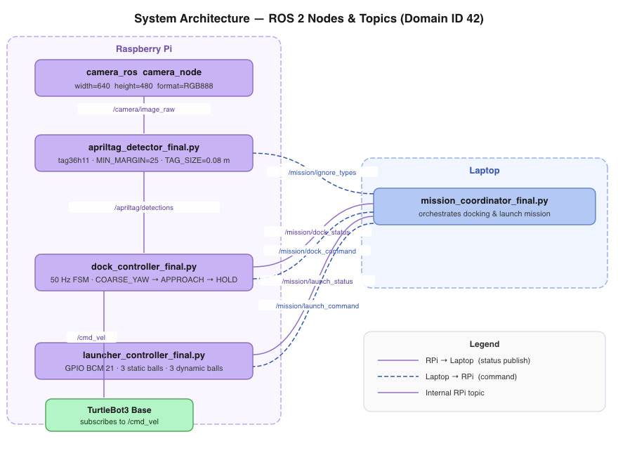

# Raspberry Pi Setup Instructions

1. Install TurtleBot3 and ROS 2 packages by following the instructions [here](https://emanual.robotis.com/docs/en/platform/turtlebot3/sbc_setup/#sbc-setup).

2. Install the camera and AprilTag detection packages.
```bash
pip install pupil-apriltags
sudo apt install -y ros-humble-camera-ros
```

3. Clone the repository into the TurtleBot3 workspace.
```bash
mkdir -p ~/turtlebot3_ws/src
cd ~/turtlebot3_ws/src
git clone <repo-url> py_pubsub
```

4. Build the workspace.
```bash
cd ~/turtlebot3_ws
colcon build
source ~/turtlebot3_ws/install/setup.bash
```

5. Add the workspace source to `~/.bashrc`.
```bash
echo "source ~/turtlebot3_ws/install/setup.bash" >> ~/.bashrc
source ~/.bashrc
```

---

# Running the Stack

Open **five terminals** on the Raspberry Pi and **five terminals** on the Laptop. Run each command in the order shown.

## Raspberry Pi Terminals

**Terminal 1 — Bringup**
```bash
export TURTLEBOT3_MODEL=burger && export ROS_DOMAIN_ID=42
source /opt/ros/humble/setup.bash
ros2 launch turtlebot3_bringup robot.launch.py
```

**Terminal 2 — Camera**
```bash
export ROS_DOMAIN_ID=42 && source /opt/ros/humble/setup.bash
ros2 run camera_ros camera_node --ros-args -p width:=640 -p height:=480 -p format:=RGB888
```

**Terminal 3 — AprilTag Detector**
```bash
export ROS_DOMAIN_ID=42 && source /opt/ros/humble/setup.bash
cd ~/turtlebot3_ws/src/py_pubsub/py_pubsub
python3 apriltag_detector_final.py
```

**Terminal 4 — Dock Controller**
```bash
export ROS_DOMAIN_ID=42 && source /opt/ros/humble/setup.bash
cd ~/turtlebot3_ws/src/py_pubsub/py_pubsub
python3 dock_controller_final.py
```

**Terminal 5 — Launcher**
```bash
export ROS_DOMAIN_ID=42 && source /opt/ros/humble/setup.bash
cd ~/turtlebot3_ws/src/py_pubsub/py_pubsub
python3 launcher_controller_final.py
```
---

# Raspberry Pi Code Documentation

The following section describes the high-level design of the three RPi nodes that handle AprilTag detection, docking, and ball launching.

## System Architecture

The diagram below shows how all ROS 2 nodes communicate via topics. Solid purple arrows indicate status messages flowing from the RPi to the Laptop; dashed blue arrows indicate commands flowing from the Laptop back to the RPi.



---

## `apriltag_detector_final.py`

Runs continuously on the RPi. Subscribes to raw camera frames, detects AprilTags using `pupil_apriltags`, classifies each tag by ID, and publishes pose information as a JSON string.

### Tunable Parameters

* `STATIC_TAG_IDS` : List of tag IDs that are treated as static docking targets. Default `[0]`.
* `DYNAMIC_DOCK_TAG_IDS` : List of tag IDs for the dynamic docking target. Default `[25]`.
* `DYNAMIC_RECEPTACLE_IDS` : List of tag IDs for the dynamic receptacle. Default `[15]`.
* `CAMERA_PARAMS` : Camera intrinsics `(fx, fy, cx, cy)` for the RPi Camera v2 at 640×480. Default `(462.0, 462.0, 320.0, 240.0)`.
* `TAG_SIZE_M` : Physical side length of the printed AprilTag in metres. Default `0.08`.
* `MIN_DECISION_MARGIN` : Detections with a confidence margin below this value are discarded to prevent false positives. Default `25.0`.
* `RATE_LOG_INTERVAL_S` : How often (seconds) detection-rate diagnostics are logged. Default `5.0`.

### Attributes

* `det_pub` : A `String` publisher on `/apriltag/detections`. Publishes a JSON payload containing pose, distance, yaw, and corners for every accepted tag in the frame.
* `detector` : A `pupil_apriltags.Detector` instance configured for the `tag36h11` family with `nthreads=2`, `quad_decimate=1.0`, and `quad_sigma=0.8`.
* `_ignore_types` : A `set` of tag-type strings (`'static'`, `'dynamic_dock'`, etc.) whose detections are suppressed. Updated via `/mission/ignore_types`.
* `_rate_window_start` : Monotonic timestamp marking the start of the current detection-rate logging window.
* `_frames_processed` : Count of image frames processed in the current rate window.
* `_type_counts` : Dict mapping each detected tag type to its detection count in the current window.

### Methods

* `_ignore_cb` : Receives a comma-separated list of tag types on `/mission/ignore_types` and updates `_ignore_types`.
* `_image_cb` : Main image processing callback. Decodes the ROS Image encoding to a numpy array, converts to grayscale using proper luminance weights (0.299 R + 0.587 G + 0.114 B), runs the AprilTag detector, filters out low-margin detections, classifies each tag, computes 3-D distance and yaw offset from `pose_t`, and publishes accepted detections as JSON.
* `_classify` : Maps a numeric tag ID to a human-readable type string (`'static'`, `'dynamic_dock'`, `'dynamic_receptacle'`, or `'unknown'`).


---

## `dock_controller_final.py`

Runs a 50 Hz control loop on the RPi. Implements a two-level state machine: an **outer** machine with states `idle`, `docking`, `docked`, and `backing_up`; and an **inner** three-phase FSM (`COARSE_YAW` → `APPROACH` → `HOLD`) that executes only while `state == 'docking'`.

### Tunable Parameters

* `DOCK_DISTANCE` : Target forward depth from the robot to the tag face in metres. Default `0.08`.
* `DIST_TOLERANCE` : Half-width of the "at distance" band in metres. Default `0.03`.
* `YAW_COARSE_THRESH` : Yaw error threshold (rad) for exiting `COARSE_YAW` into `APPROACH`. Default `0.08` (~4.5°).
* `YAW_DRIFT_LIMIT` : Maximum yaw drift (rad) allowed during `APPROACH` before aborting back to `COARSE_YAW`. Default `0.15` (~8.6°).
* `YAW_HOLD_THRESH` : Yaw error tolerance (rad) in `HOLD` phase. Default `0.10` (~5.7°).
* `KP_DIST` : Proportional gain on distance error for the `APPROACH` linear drive. Default `0.28`.
* `KP_YAW` : Proportional gain on yaw error for `COARSE_YAW` rotation. Default `0.45`.
* `KP_YAW_APPROACH` : Gentler proportional yaw gain used during `APPROACH` so it does not fight the linear drive. Default `0.20`.
* `MAX_VX` / `MIN_VX` : Maximum and minimum linear speed (m/s) during `APPROACH`. Defaults `0.06` / `0.02`.
* `MAX_WZ` / `MAX_WZ_APPROACH` : Angular speed caps (rad/s) for `COARSE_YAW` and `APPROACH` respectively. Defaults `0.30` / `0.15`.
* `LOST_TIMEOUT` : Seconds without a tag detection before the robot stops and resets to `COARSE_YAW`. Default `6.0`.
* `BRIEF_LOSS_HOLD_S` : Short grace period (seconds) during which the robot holds position using a stale detection. Default `0.3`.
* `DOCKED_CONFIRM_TICKS` : Number of consecutive 50 Hz ticks that must be in-tolerance before transitioning to `docked`. Default `15`.
* `BACKUP_SPEED` / `BACKUP_DURATION` : Speed and duration for the reverse manoeuvre. Defaults `0.05 m/s` / `2.0 s`.

### Attributes

* `state` : Outer FSM state string — `'idle'`, `'docking'`, `'docked'`, or `'backing_up'`.
* `target_type` : Tag type to track during docking (`'static'` or `'dynamic_dock'`).
* `_dock_phase` : Inner FSM phase — `'COARSE_YAW'`, `'APPROACH'`, or `'HOLD'`.
* `last_det` : Most recent tag detection dict (from `/apriltag/detections`), or `None`.
* `last_det_t` : Monotonic timestamp of the last received detection.
* `_docked_count` : Count of consecutive in-tolerance ticks. Increments on good ticks; decays by 1 on bad ticks (REV-9E).
* `_backup_start` : Monotonic timestamp marking when the backup manoeuvre began.
* `_hold_stop_sent` : Boolean flag ensuring the zero-velocity command is sent only once per `HOLD` entry (FIX-6).
* `cmd_pub` : A `Twist` publisher on `/cmd_vel`.
* `status_pub` : A `String` publisher on `/mission/dock_status`.

### Methods

* `_cmd_cb` : Handles commands on `/mission/dock_command` — `'dock_static'` or `'dock_dynamic'` starts docking; `'backup'` begins a timed reverse; `'cancel'` aborts to idle.
* `_det_cb` : Updates `last_det` and `last_det_t` whenever a matching tag type appears on `/apriltag/detections`.
* `_tick` : Main 50 Hz control callback. Handles the backing-up timer, publishes heartbeats in idle/docked states, manages three tiers of tag-loss response (brief hold → lost timeout → reset), and dispatches to the inner phase handler.
* `_phase_coarse_yaw` : Rotates in place (vx = 0) until `|yaw_off| < YAW_COARSE_THRESH`. Includes FIX-5a (jump straight to HOLD if already in full tolerance) and FIX-5b/FIX-9 (jump to APPROACH if overshot and yaw is aligned).
* `_phase_approach` : Drives forward or reverse with a bidirectional P-controller on distance error and a gentle yaw correction (FIX-8). Enforces a `MIN_VX` deadband floor. Aborts to `COARSE_YAW` if yaw drifts past `YAW_DRIFT_LIMIT`.
* `_phase_hold` : Keeps the robot stopped and accumulates in-tolerance ticks toward `DOCKED_CONFIRM_TICKS`. Decays the counter on out-of-tolerance ticks and escapes to `APPROACH` (large distance error) or `COARSE_YAW` (yaw drift, FIX-7).


---

## `launcher_controller_final.py`

Runs on the RPi. Receives fire commands on `/mission/launch_command` and pulses GPIO BCM pin 21 to actuate the solenoid launcher. All firing sequences run in daemon threads so the ROS spin loop is never blocked.

### Tunable Parameters

* `LAUNCHER_PIN` : BCM GPIO pin connected to the solenoid. Default `21`.
* `FIRE_PULSE_DURATION` : Duration in seconds the GPIO pin is held HIGH per shot. Default `0.25`.
* `BALLS_STATIC` : Number of balls fired in the static sequence. Default `3`.
* `BALLS_DYNAMIC` : Number of balls fired (total) in the dynamic sequence before `'dynamic_done'` is published. Default `3`.
* `STATIC_INTER_SHOT_DELAYS` : List of **overall** delay targets in seconds measured from the **start** of each shot (not from pin-LOW). The sleep after each shot is shortened by however long the pulse and OS overhead already took. Default `[4.0, 6.0]` — 4 s from shot 1 start to shot 2 start; 6 s from shot 2 start to shot 3 start.

### Attributes

* `status_pub` : A `String` publisher on `/mission/launch_status`.
* `firing` : Boolean lock. Set `True` before a fire thread is spawned and reset `False` when the sequence ends. Prevents duplicate concurrent fire commands.
* `balls_fired` : Running count of balls fired in the current sequence.
* `GPIO` : The `RPi.GPIO` module, or `None` if initialisation failed (simulation mode).
* `gpio_ok` : `True` if GPIO initialised successfully; `False` in simulation mode.

### Methods

* `_cmd_cb` : Receives `'fire_static'`, `'fire_dynamic'`/`'fire_one'`, or `'stop'` on `/mission/launch_command`. Checks the `firing` lock before spawning a thread; `'stop'` forces the pin LOW immediately and resets `firing`.
* `_fire_static_sequence` : Fires `BALLS_STATIC` (3) balls in a background thread. After each shot (except the last) it computes the remaining sleep needed to hit the `STATIC_INTER_SHOT_DELAYS` overall-delay target, accounting for time already elapsed since the shot began. Publishes `'static_done'` when complete.
* `_fire_single` : Fires exactly one ball in a background thread. Resets `balls_fired` to `0` on entry (BUG-3 fix) and publishes `'dynamic_fired_1'`. Publishes `'dynamic_done'` when `balls_fired >= BALLS_DYNAMIC`.
* `_fire_one_ball` : Low-level helper. Sets the GPIO pin HIGH for `FIRE_PULSE_DURATION` seconds, then LOW. Returns immediately if `firing` has been cleared.
* `_set_pin` : Sets GPIO BCM pin 21 HIGH or LOW. Falls back to a log message in simulation mode (when `gpio_ok` is `False`).


